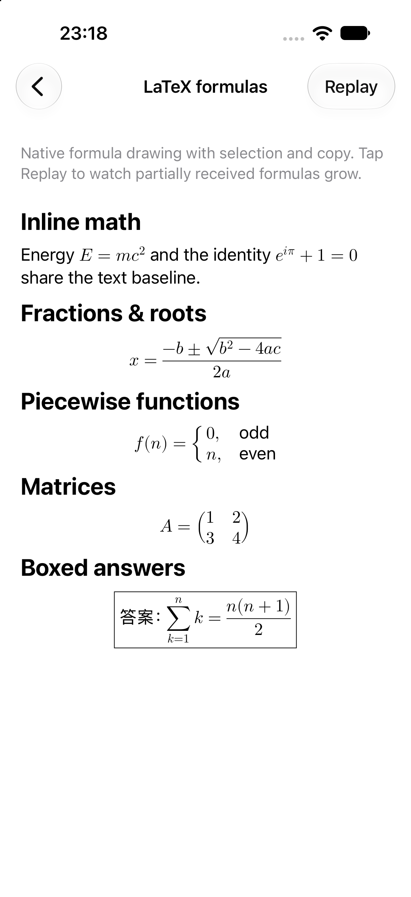

# RichTextView

`RichTextView` is a unified rich-text node-tree renderer for UIKit, built on
CoreText. Applications describe content with an immutable
`RichContentDocument`, then use the same rendering pipeline for text, links,
mentions, images, attachments, lists, quotes, code, LaTeX formulas, and custom node types.

Markdown is one built-in input adapter. It converts a Markdown AST into the
same node tree; it is not the renderer's underlying data model.

The library does not include application-specific message, routing, analytics,
networking, or image-cache dependencies.

## Example

<table>
  <tr>
    <td align="center"><br><sub>Unified node tree</sub></td>
    <td align="center"><br><sub>Markdown selection and Copy menu</sub></td>
    <td align="center"><br><sub>Native LaTeX formulas</sub></td>
  </tr>
</table>

## Structure

```text
Sources
├── Core        Unified node-tree model and transforms
├── Rendering   Node builders, CoreText layout, drawing, views, and interaction
└── Markdown    Optional input path from swift-markdown AST to the node tree
```

## Swift Package Manager

Add this repository and link the `RichTextView` product. It contains the node
tree and renderer without linking the Markdown binary.

```swift
import RichTextView
```

To parse Markdown, also link and import the `RichTextViewMarkdown` product:

```swift
import RichTextView
import RichTextViewMarkdown
```

## CocoaPods

```ruby
pod 'RichTextView', '0.1.1'
```

Add the Markdown input adapter only when needed:

```ruby
pod 'RichTextView/Markdown', '0.1.1'
```

The parser, syntax highlighting, and math renderer consume pinned static
XCFrameworks from [RichTextViewBinaries](https://github.com/FeliksLv01/RichTextViewBinaries).
Math fonts are embedded in the binary; consumers do not need a separate font bundle.

## Render a node tree

```swift
let view = RichTextView()
view.setContent(RichContentDocument(
    id: "article",
    children: [
        .paragraph(id: "paragraph-1", text: "A unified rich-text tree")
    ]
))
```

`RichTextView` renders at its current width and rerenders automatically when
that width changes. Keep node IDs stable between updates so streaming content
can reuse unchanged nodes.

For simple labels, `RichTextView` also accepts `String` and
`NSAttributedString` directly.

## Markdown input adapter

Markdown is normalized into the same node tree before rendering:

```swift
let parsed = RichMarkdownParser(imageSize: CGSize(width: 64, height: 40)).parse(
    markdown,
    documentID: "article"
)
let view = RichTextView()
view.setContent(parsed.document)
```

For background preparation, custom element-builder registries, or precomputed
layouts shared across views, use the lower-level `RichContentRenderer`,
`RichTextLayoutEngine`, and `apply` APIs described in
[Architecture](Documentation/Architecture.md).

See [Architecture](Documentation/Architecture.md) for extension points,
threading, attachments, images, interaction, and selection.

Enable native long-press selection and copy for any rendered input, including
Markdown normalized through `RichTextViewMarkdown`:

```swift
richTextView.isTextSelectionEnabled = true
```

The Example app also includes a complete host-side
`RichSelectionMenuPresenting` implementation. It anchors a Copy menu to the
selection, keeps handle gestures interactive, writes `selection.plainText` to
the pasteboard, and clears the selection after the action completes.

`ExampleRemoteImageLoader` shows the complementary image-loading boundary: the
renderer keeps fixed image geometry while a cancellable `URLSession` request
loads and caches HTTPS image data, then refreshes only the image display.

Text nodes accept semantic or CSS-style foreground and background colors.
Markdown inline code receives the configured `codeBackgroundColor`, while
fenced code blocks use independent text, background, inset, and corner-radius
tokens. Fenced code preserves source lines and scrolls horizontally when a line
exceeds the viewport; a language header provides a direct Copy action. Hosts can
provide cached syntax-highlighted attributed text through
`codeBlockPresentation`. RichTextView also exposes one global
`RichCodeBlockHighlightingPlugin` slot for a custom reusable implementation.
The built-in implementation is registered once at application launch and is
then retained and reused across renders:

```swift
RichCodeBlockHighlighting.useBuiltIn(theme: .github)
```

Its implementation details remain internal: the public API only contains
generic `RichCodeHighlightTheme` and token-style models. Four presets are
included: `.github`, `.xcode`, `.monokai`, and `.dracula`. The current bundled
grammar highlights Swift (`swift` and `swiftlang`); unknown languages fall back
to the normal plain-text code-block presentation.

Markdown tables are rendered by the core library as horizontally scrollable
attachments. Cells still use the same node-tree renderer, so links, inline
code, styled text, and future custom inline nodes can be mixed inside a cell.
The built-in `RichTableStyle` follows the Example/REDoc visual baseline and can
be replaced through `RichContentRenderingConfiguration.tableStyle`.

## LaTeX formulas

The Markdown adapter recognizes inline `\(…\)` and display `$$…$$` / `\[…\]` math.
Formulas become `RichLatexElement` nodes: iosMath performs mathematical typesetting,
and the CoreText drawing pipeline draws the result without a UILabel per formula.
Inline formulas follow the text baseline; display formulas are centered within the
available width. Selection copies their LaTeX source.

```swift
let markdown = #"""
Energy \(E = mc^2\).

$$
\boxed{\frac{-b \pm \sqrt{b^2 - 4ac}}{2a}}
$$
"""#
let parsed = RichMarkdownParser(imageSize: CGSize(width: 24, height: 24)).parse(markdown, documentID: "math")
richTextView.setContent(parsed.document)
```

Fractions, roots, matrices, piecewise `cases`, nested `\boxed{…}`, and Unicode
text inside `\text{…}` are supported by the bundled iosMath binary. This is a
math-mode subset of LaTeX, not a full TeX engine.

For streaming, retain the renderer and layout engine across updates and set
`streaming: true` on both parsing and rendering. Use `false` for the final update:

```swift
let parser = RichMarkdownParser(imageSize: CGSize(width: 24, height: 24))
let renderer = RichContentRenderer()
let engine = RichTextLayoutEngine()

func update(source: String, width: CGFloat, isComplete: Bool) {
    let document = parser.parse(source, documentID: "math", streaming: !isComplete).document
    let snapshot = renderer.render(document: document, constrainedWidth: width,
        configuration: .standard, streaming: !isComplete).snapshot
    let layout = engine.layout(snapshot: snapshot,
        constrainedTo: CGSize(width: width, height: .greatestFiniteMagnitude))
    richTextView.apply(snapshot, layout: layout)
}
```

During streaming, a display-only preview closes unfinished groups and environments
so complete rows can appear before `\end{cases}` arrives. If the preview still
cannot be parsed, the preceding valid formula remains visible. The original
source is unchanged, and final invalid input falls back to readable source.
See **LaTeX formulas → Replay** in the Example app for a 20 ms character stream.

## Custom nodes

`RichContentNodeType` is open-ended. A host can define a semantic node type and
register one builder without changing the library:

```swift
extension RichContentNodeType {
    static let answerCard = Self(rawValue: "answer-card")
}

let registry = RichContentElementBuilderRegistry.standard
    .registering(AnswerCardElementBuilder())
let renderer = RichContentRenderer(registry: registry)
```

Use stable node IDs and immutable `Equatable` node content. Reuse one
`RichContentRenderer` per document stream. Custom builders and presentation
resolvers must expose an `inputs` value conforming to `Hashable`, containing
all external state that affects their output. Equality compares the values,
not just their hashes. Stateless implementations can use `let inputs = false`.

## Streaming updates

Each parser call parses the current source. The renderer reuses elements when
content, children, builder/resolver inputs, width, traits and configuration
are unchanged. No caller-managed revision or separate cache key is required.

`RichTextLayoutEngine` caches unchanged text layouts, and `RichTextView`
cancels obsolete layout work by generation. When asynchronous drawing is
enabled, the view keeps the preceding rendered contents visible until the next
batch of changed tiles is ready by default. Unchanged prefix tiles keep their
layers and bitmaps, and each tile only draws intersecting text. Set
`preservesRenderedContentDuringAsyncUpdates = false` if a host prefers an empty
intermediate state.

For visible streaming messages, enable `displaysAsynchronously` and
`animatesStreamingChanges`. The latter fades only appended words using Core
Animation masks; it does not parse or lay out text on animation frames. Rewrites,
reflow, width/style changes and Reduce Motion skip the transition. Disable it for
history loads and completed messages.

## Example app

The [Example](Example) app uses the iOS 15 scene lifecycle and consumes this
repository as a local Swift package. Its table-based catalog opens a detail page
for each integration style: `String`, attributed image-text mixing, a complex
typed node tree, a horizontally scrollable rich table, selectable Markdown, and native formulas with streaming replay.
Generate and build its Xcode project with:

```bash
./Scripts/test-example.sh
```

`Example/RichTextViewExample.xcodeproj` is generated from
`Example/project.yml` by XcodeGen and is intentionally not committed.
