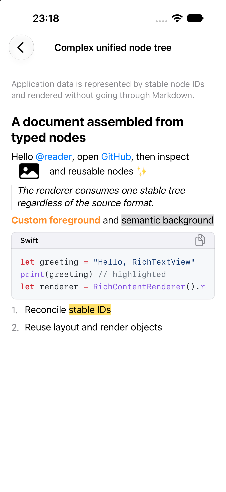
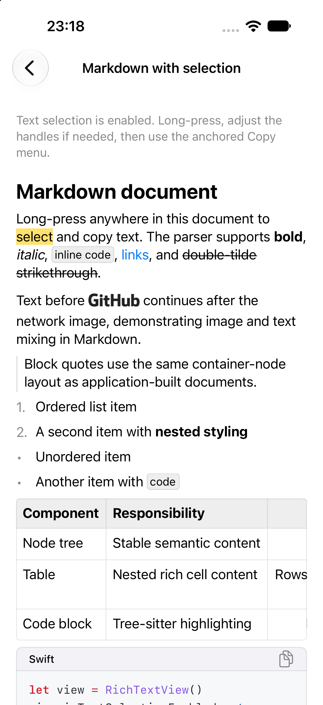
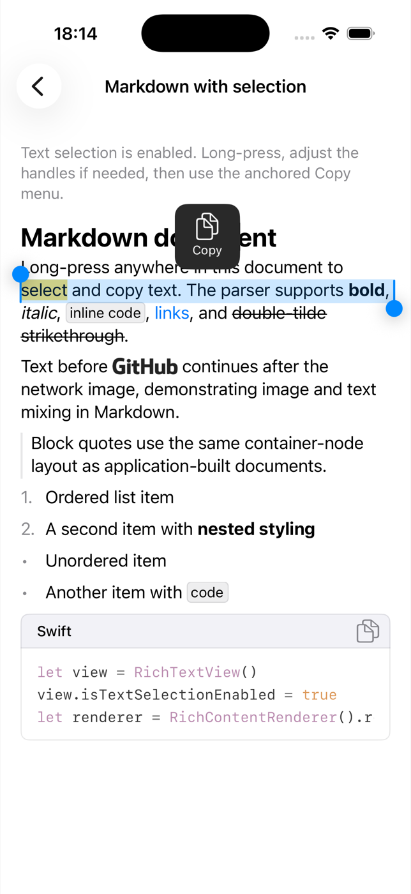

# RichTextView

`RichTextView` is a unified rich-text node-tree renderer for UIKit, built on
CoreText. Applications describe content with an immutable
`RichContentDocument`, then use the same rendering pipeline for text, links,
mentions, images, attachments, lists, quotes, code, and custom node types.

Markdown is one built-in input adapter. It converts a Markdown AST into the
same node tree; it is not the renderer's underlying data model.

The library does not include application-specific message, routing, analytics,
theme, networking, or image-cache dependencies.

## Example

<table>
  <tr>
    <td align="center"><br><sub>Unified node tree</sub></td>
    <td align="center"><br><sub>Markdown and highlighted code block</sub></td>
    <td align="center"><br><sub>Text selection and copy menu</sub></td>
  </tr>
</table>

## Structure

```text
Sources
├── Core        Unified node-tree model and transforms
├── Rendering   Node builders, CoreText layout, drawing, views, and interaction
└── Markdown    Optional input path from swift-markdown AST to the node tree
```

## Swift Package Manager

Add this repository and link the `RichTextView` product. It contains the node
tree and renderer without linking the Markdown binary.

```swift
import RichTextView
```

To parse Markdown, also link and import the `RichTextViewMarkdown` product:

```swift
import RichTextView
import RichTextViewMarkdown
```

## CocoaPods

```ruby
pod 'RichTextView', '0.1.0'
```

Add the Markdown input adapter only when needed:

```ruby
pod 'RichTextView/Markdown', '0.1.0'
```

The adapter uses the static `Markdown.xcframework` published by
[`swift-markdown-xcframework`](https://github.com/FeliksLv01/swift-markdown-xcframework).

## Render a node tree

```swift
let document = RichContentDocument(
    root: RichContentNode(
        id: "article",
        type: .root,
        children: [
            RichContentNode(
                id: "paragraph-1",
                type: .paragraph,
                children: [
                    RichContentNode(
                        id: "text-1",
                        type: .text,
                        content: RichTextContent(text: "A unified rich-text tree")
                    )
                ]
            )
        ]
    )
)
let rendered = RichContentRenderer().render(
    document: document,
    constrainedWidth: 320,
    configuration: .standard
)

let view = RichTextView()
view.apply(rendered.snapshot)
```

For simple labels, `RichTextView` also accepts `String` and
`NSAttributedString` directly.

## Markdown input adapter

Markdown is normalized into the same node tree before rendering:

```swift
let parsed = RichMarkdownParser().parse(markdown, documentID: "article")
let rendered = RichContentRenderer().render(
    document: parsed.document,
    constrainedWidth: 320,
    configuration: .standard
)

let view = RichTextView()
view.apply(rendered.snapshot)
```

See [Architecture](Documentation/Architecture.md) for extension points,
threading, attachments, images, interaction, and selection.

Enable native long-press selection and copy for any rendered input, including
Markdown normalized through `RichTextViewMarkdown`:

```swift
richTextView.isTextSelectionEnabled = true
```

The Example app also includes a complete host-side
`RichSelectionMenuPresenting` implementation. It anchors a Copy menu to the
selection, keeps handle gestures interactive, writes `selection.plainText` to
the pasteboard, and clears the selection after the action completes.

`ExampleRemoteImageLoader` shows the complementary image-loading boundary: the
renderer keeps fixed image geometry while a cancellable `URLSession` request
loads and caches HTTPS image data, then refreshes only the image display.

Text nodes accept semantic or CSS-style foreground and background colors.
Markdown inline code receives the configured `codeBackgroundColor`, while
fenced code blocks use independent text, background, inset, and corner-radius
tokens. Fenced code preserves source lines and scrolls horizontally when a line
exceeds the viewport; a language header provides a direct Copy action. Hosts can
provide cached syntax-highlighted attributed text through
`codeBlockPresentation`. The Example uses HighlighterSwift as one replaceable
integration; it is not a dependency of the core renderer.

## Streaming updates

Pass the preceding document back to the Markdown parser so stable node IDs and
layout/display revisions survive each partial source update:

```swift
let next = parser.parse(
    partialMarkdown,
    documentID: messageID,
    previousDocument: previous?.document
)
previous = next
```

`RichTextLayoutEngine` caches unchanged text layouts, and `RichTextView`
cancels obsolete layout work by generation. When asynchronous drawing is
enabled, the view keeps the preceding rendered contents visible until the next
bitmap is ready by default. Set
`preservesRenderedContentDuringAsyncUpdates = false` if a host prefers an empty
intermediate state.

## Example app

The [Example](Example) app uses the iOS 15 scene lifecycle and consumes this
repository as a local Swift package. Its table-based catalog opens a detail page
for each integration style: `String`, attributed image-text mixing, a complex
typed node tree, and selectable Markdown.
Generate and build its Xcode project with:

```bash
./Scripts/test-example.sh
```

`Example/RichTextViewExample.xcodeproj` is generated from
`Example/project.yml` by XcodeGen and is intentionally not committed.
